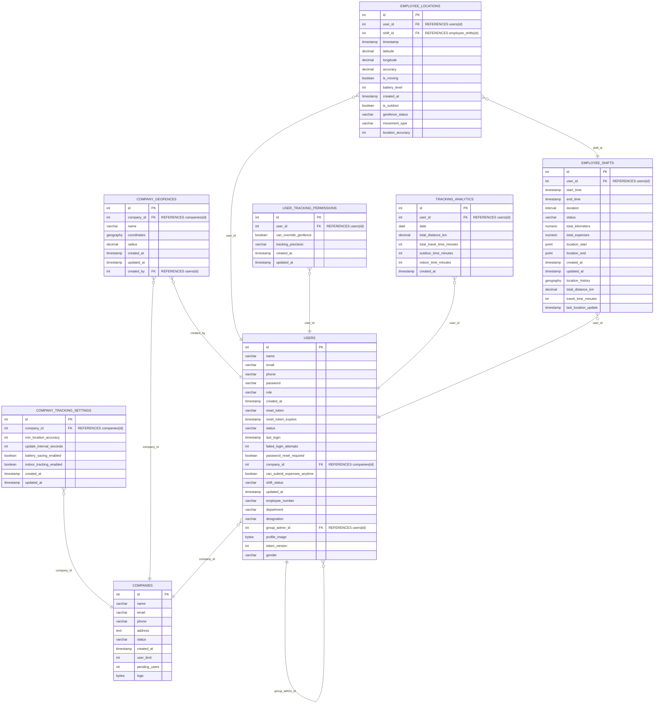

```mermaid
erDiagram
    EMPLOYEE_LOCATIONS {
      int id PK
      int user_id FK "REFERENCES users(id)"
      int shift_id FK "REFERENCES employee_shifts(id)"
      timestamp timestamp
      decimal latitude
      decimal longitude
      decimal accuracy
      boolean is_moving
      int battery_level
      timestamp created_at
      boolean is_outdoor
      varchar geofence_status
      varchar movement_type
      int location_accuracy
    }

    COMPANY_GEOFENCES {
      int id PK
      int company_id FK "REFERENCES companies(id)"
      varchar name
      geography coordinates
      decimal radius
      timestamp created_at
      timestamp updated_at
      int created_by FK "REFERENCES users(id)"
    }

    EMPLOYEE_SHIFTS {
      int id PK
      int user_id FK "REFERENCES users(id)"
      timestamp start_time
      timestamp end_time
      interval duration
      varchar status
      numeric total_kilometers
      numeric total_expenses
      point location_start
      point location_end
      timestamp created_at
      timestamp updated_at
      geography location_history
      decimal total_distance_km
      int travel_time_minutes
      timestamp last_location_update
    }

    USER_TRACKING_PERMISSIONS {
      int id PK
      int user_id FK "REFERENCES users(id)"
      boolean can_override_geofence
      varchar tracking_precision
      timestamp created_at
      timestamp updated_at
    }

    COMPANY_TRACKING_SETTINGS {
      int id PK
      int company_id FK "REFERENCES companies(id)"
      int min_location_accuracy
      int update_interval_seconds
      boolean battery_saving_enabled
      boolean indoor_tracking_enabled
      timestamp created_at
      timestamp updated_at
    }

    TRACKING_ANALYTICS {
      int id PK
      int user_id FK "REFERENCES users(id)"
      date date
      decimal total_distance_km
      int total_travel_time_minutes
      int outdoor_time_minutes
      int indoor_time_minutes
      timestamp created_at
    }

    USERS {
      int id PK
      varchar name
      varchar email
      varchar phone
      varchar password
      varchar role
      timestamp created_at
      varchar reset_token
      timestamp reset_token_expires
      varchar status
      timestamp last_login
      int failed_login_attempts
      boolean password_reset_required
      int company_id FK "REFERENCES companies(id)"
      boolean can_submit_expenses_anytime
      varchar shift_status
      timestamp updated_at
      varchar employee_number
      varchar department
      varchar designation
      int group_admin_id FK "REFERENCES users(id)"
      bytea profile_image
      int token_version
      varchar gender
    }

    COMPANIES {
      int id PK
      varchar name
      varchar email
      varchar phone
      text address
      varchar status
      timestamp created_at
      int user_limit
      int pending_users
      bytea logo
    }

    %% Relationships based on foreign keys
    EMPLOYEE_LOCATIONS }o--|| USERS : "user_id"
    EMPLOYEE_LOCATIONS }o--|| EMPLOYEE_SHIFTS : "shift_id"
    EMPLOYEE_SHIFTS }o--|| USERS : "user_id"
    USER_TRACKING_PERMISSIONS }o--|| USERS : "user_id"
    TRACKING_ANALYTICS }o--|| USERS : "user_id"
    COMPANY_GEOFENCES }o--|| COMPANIES : "company_id"
    COMPANY_TRACKING_SETTINGS }o--|| COMPANIES : "company_id"
    USERS }o--|| COMPANIES : "company_id"
    COMPANY_GEOFENCES }o--|| USERS : "created_by"
    USERS ||--o{ USERS : "group_admin_id"
```
